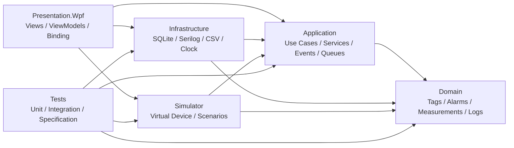
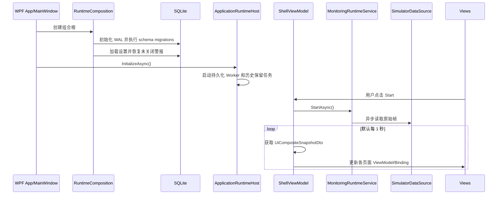
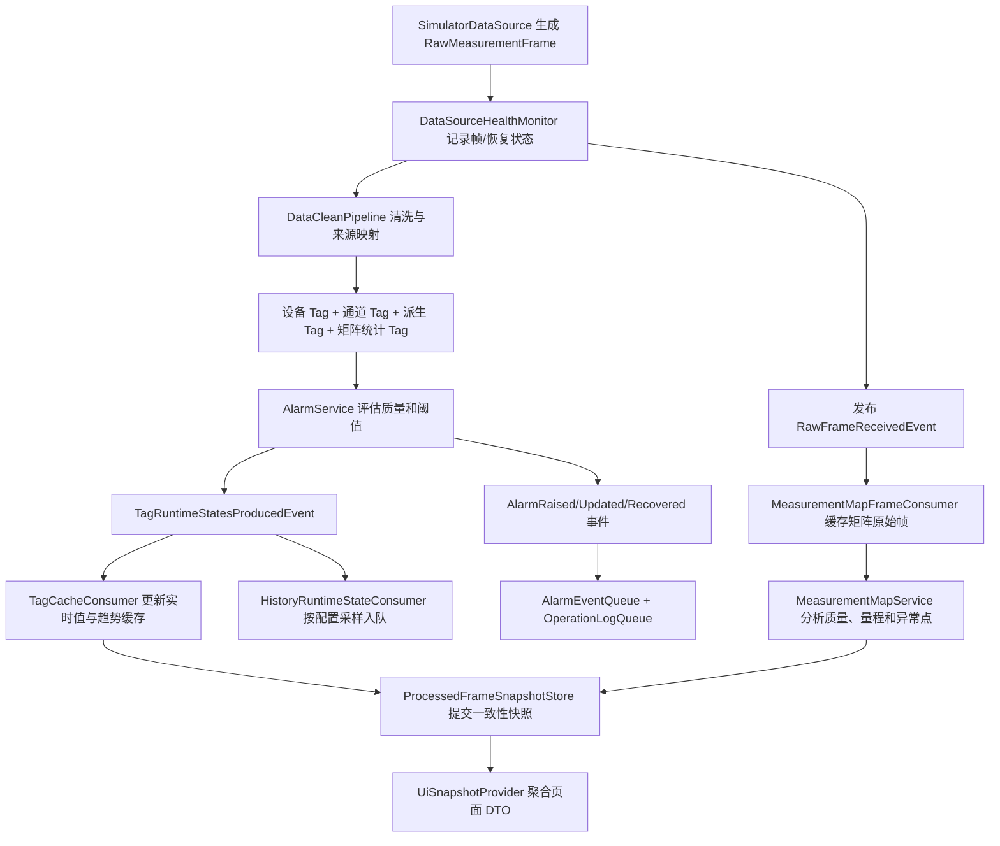

# MultiChannelMonitor

基于 .NET 10、WPF 与 MVVM 的多通道测量仪器监控和数据分析系统。

## Preview


## 项目简介

MultiChannelMonitor 是一个面向实验室测量、工业仪器监控和上位机开发演示的 Windows 桌面应用。项目通过内置模拟器持续生成设备状态、温度、压力、光强、电压、电流、振动以及 16 x 16 光强矩阵数据，并将原始设备帧转换为统一的 Tag 运行时状态。

项目重点展示完整的上位机应用层数据闭环，而不是单纯的 WPF 页面或静态图表：数据经过清洗、质量映射、派生量计算、警报评估、实时缓存、历史采样、批量持久化和 UI 快照聚合后，驱动 Dashboard、实时 Tag、趋势、警报中心、历史查询、矩阵热力图和日志设置页面。

系统采用分层架构，将领域模型、应用编排、基础设施、设备模拟和 WPF 表现层分离。数据采集周期、UI 刷新周期和数据库批量写入周期彼此解耦，便于展示异步任务、事件分发、队列削峰、SQLite 本地存储、MVVM Binding 与桌面应用生命周期管理等工程实践。

当前仓库定位为可运行的模拟仪器监控 Demo 和求职作品集。项目中暂未实现真实 Modbus、串口、TCP 或厂商 SDK 接入，也未提供用户认证、网络 API、容器化和生产级安装包，因此不应直接用于生产现场安全控制或联锁。

## 核心功能

- 内置多通道虚拟设备，默认每 500 ms 生成一帧数据。
- 模拟正常波动、慢漂移、尖峰、电压跌落、通道错误、设备离线、矩阵热点和低值区域。
- 将原始帧映射为设备、测量、电气、机械、派生量和矩阵统计等统一 Tag。
- 计算功率、负载率、矩阵均值、最大值、最小值、均匀性、异常点数量和热点坐标。
- 基于质量状态和高低阈值执行警报评估，支持触发、更新、确认和恢复生命周期。
- 使用内存快照和环形趋势缓存支撑实时页面，避免 UI 直接读取设备或数据库。
- 展示 Dashboard、实时 Tag、趋势分析、警报中心、历史查询、矩阵热力图、运行日志和设置。
- 使用 ScottPlot 绘制实时/历史趋势、阈值线、非 Good 质量点和尖峰标记。
- 支持历史分页查询、快捷时间范围、取消查询和全量匹配结果 CSV 导出。
- 使用 SQLite 持久化历史采样、警报事件、业务操作日志、Tag 阈值和运行参数。
- 使用独立后台 Worker 对历史、警报和操作日志进行定时或定量批量写入。
- 使用 Serilog 输出异步滚动诊断日志，并捕获 WPF Dispatcher 与 AppDomain 未处理异常。
- 提供数据源超时看门狗；超时后保留最后值并将运行状态标记为 Offline。
- 提供历史数据保留任务，默认清理 30 天以前的数据。

## 技术栈

| 技术 | 用途 | 项目中的体现位置 |
| --- | --- | --- |
| .NET 10 / C# | 运行时、领域模型、异步任务与应用服务 | `Domain/`、`Application/`、`Infrastructure/`、`Simulator/` |
| WPF / XAML | Windows 桌面 UI、Binding、模板、样式和页面组合 | `MultiChannelMonitor/Views/`、`MainWindow.xaml` |
| CommunityToolkit.Mvvm 8.4.2 | `ObservableObject`、`ObservableProperty`、`RelayCommand` | `MultiChannelMonitor/ViewModels/`、`Models/` |
| ScottPlot.WPF 5.0.56 | 实时趋势和历史趋势绘制 | `TrendChartRenderer.cs`、各趋势视图 |
| Microsoft.Data.Sqlite 10.0.9 | SQLite 连接、事务、查询和迁移 | `Infrastructure/Persistence/` |
| SQLite WAL | 本地历史、警报、日志和设置存储 | `SqliteConnectionFactory.cs`、`SqliteSchemaMigrations.cs` |
| Serilog 4.3.1 | 结构化诊断日志门面实现 | `Infrastructure/Logging/`、`AppLogging/` |
| Serilog.Sinks.Async / File / Debug | 异步文件日志、调试输出、滚动保留 | `LoggingBootstrapper.cs` |
| xUnit 2.9.3 | 单元测试、集成测试和规格测试 | `Tests/` |
| coverlet.collector 6.0.4 | 测试覆盖率采集 | `Tests/Tests.csproj` |
| `.slnx` | 解决方案组织格式 | `MultiChannelMonitor.slnx` |

> 说明：早期设计文档中曾规划 EF Core，但当前代码实际使用 `Microsoft.Data.Sqlite`、参数化 SQL 和显式事务，并未引用 Entity Framework Core。

## 项目架构

项目整体采用接近 Clean Architecture 的分层方式，并在 WPF 表现层使用 MVVM。依赖方向以领域和应用层为中心，基础设施实现应用层抽象，WPF 根组合器负责在启动时装配具体实现。



### 分层职责

| 层/工程 | 主要职责 | 依赖关系 |
| --- | --- | --- |
| `Domain` | 领域实体、值对象、枚举、规则和数据契约 | 不依赖其他项目或第三方业务框架 |
| `Application` | 数据管道、服务、用例、事件、缓存、队列和后台 Worker | 依赖 `Domain`、`AppLogging` |
| `Infrastructure` | SQLite、Serilog、CSV、系统时钟和外部数据源占位实现 | 实现 `Application` 抽象 |
| `Simulator` | 虚拟设备、噪声模型、异常场景和原始帧生成 | 实现 `IDataSource` |
| `Presentation.Wpf` | View、ViewModel、Binding、命令、导航和图表渲染 | 作为组合根引用所有运行时模块 |
| `AppLogging` | 与 Serilog 解耦的全局日志门面 | 不依赖 Serilog |
| `Tests` | 领域、应用、基础设施、模拟器和规格测试 | 引用非 UI 核心工程 |

当前依赖注入采用 `RuntimeComposition` 手工构造，而非 Microsoft.Extensions.DependencyInjection 容器。优点是 Demo 的对象关系直观、启动路径明确；代价是组合根较长，模块扩展后需要进一步拆分注册逻辑。

## 目录结构

```text
MultiChannelMonitor/
├── Application/                 # 应用服务、用例、事件、缓存、队列与后台任务
│   ├── Abstractions/            # 数据源、持久化、时间、导出、通知等接口
│   ├── BackgroundWorkers/       # 历史/警报/操作日志批量持久化 Worker
│   ├── Caches/                  # Tag、矩阵与处理帧快照缓存
│   ├── Configuration/           # 运行参数、Tag 动态配置与校验
│   ├── DTOs/                    # 面向页面和用例的只读数据模型
│   ├── Events/                  # 原始帧、Tag、警报和健康状态事件
│   ├── Pipelines/               # RawFrame 到 CleanedTagValue 的清洗映射
│   ├── Queues/                  # 基于 Channel 的异步内存队列
│   ├── Services/                # 运行时编排及各业务域服务
│   └── UseCases/                # 采集、查询、确认、导出和保存设置入口
├── AppLogging/                  # 应用级日志抽象与静态门面
├── Domain/                      # 纯领域模型和规则
│   ├── Alarms/                  # 警报定义、规则、事件和状态
│   ├── Devices/                 # 设备状态、错误码和采样配置
│   ├── Measurements/            # 原始帧、通道、矩阵和质量模型
│   ├── Rules/                   # 质量、Tag 校验与矩阵统计规则
│   └── Tags/                    # Tag 定义、值、来源映射和运行状态
├── Infrastructure/             # 技术实现
│   ├── DataSource/              # 真实外部数据源占位实现
│   ├── Export/                  # UTF-8 BOM CSV 导出
│   ├── Logging/                 # Serilog 初始化和适配器
│   └── Persistence/             # SQLite 仓储、连接工厂和版本迁移
├── MultiChannelMonitor/         # WPF Presentation 工程
│   ├── Behaviors/               # WPF 附加行为
│   ├── Bootstrap/               # 组合根与 ViewModel 创建
│   ├── Controls/                # 可复用控件
│   ├── Converters/              # 警报/质量到颜色的转换器
│   ├── Models/                  # 页面显示模型
│   ├── Renderers/               # ScottPlot 趋势和热力图模型渲染
│   ├── Services/                # Dialog、文件选择和 UI Dispatcher
│   ├── ViewModels/              # Shell 及七个页面 ViewModel
│   └── Views/                   # 页面 XAML 与少量视图代码
├── Simulator/                   # 多通道虚拟设备
│   ├── Generators/              # 通道、矩阵、状态和完整帧生成器
│   ├── Noise/                   # 高斯噪声、正弦波、漂移和尖峰模型
│   ├── Profiles/                # 默认设备规格与模拟配置
│   └── Scenarios/               # 正常、警报、离线和矩阵异常场景
├── Tests/                       # xUnit 测试与测试支持代码
├── README.MD                    # 项目gai文档
├── MultiChannelMonitor.slnx     # 解决方案入口
└── LICENSE.txt                  # GNU AGPL v3 许可证
```

`bin/`、`obj/`、`.vs/`、运行数据库和日志属于生成内容，不应作为源码提交。

## 核心模块说明

### Domain：领域模型与业务规则

`Domain` 定义系统中的稳定业务语言。`RawMeasurementFrame` 描述设备侧原始事实；`TagDefinition`、`TagSourceMapping`、`TagValue` 和 `TagRuntimeState` 描述应用层统一数据；`AlarmEvent`、`AlarmRule` 和 `ActiveAlarm` 描述警报生命周期。

关键规则包括 `QualityRule`、`TagValidationRule`、`MatrixStatisticsCalculator` 和 `MatrixStatisticsRule`。该层不引用 WPF、SQLite、Serilog 或 MVVM 框架，便于独立测试和替换外围技术。

### Simulator：虚拟设备与异常场景

`FakeDataGenerator` 聚合通道、设备状态和矩阵生成器，默认设备 ID 为 `MCMD-001`。六个通道分别模拟温度、压力、光强、电压、电流和振动；矩阵为 16 x 16 光强分布。

默认 `DemoScenario` 以 120 秒为一个循环，注入温度上升、振动尖峰、电压跌落、光强通道错误、设备 Error/Offline、矩阵热点和低值区域。模拟器只产生原始帧，不直接操作 Tag、警报或 UI，因此可以由真实数据源适配器替换。

### Application：数据处理与运行时编排

`MonitoringRuntimeService` 是实时链路核心。它异步枚举 `IDataSource` 帧，通过 `DataSourceHealthMonitor` 监测超时，调用 `DataCleanPipeline` 完成来源映射和派生量计算，再交给 `AlarmService` 生成 Tag 状态和警报变化。

`ApplicationEventPublisher` 按注册顺序分发强类型事件，并允许处理器设置 `Critical` 或 `Isolated` 失败策略。Tag 缓存、历史采样、警报入队、业务日志和矩阵分析通过事件消费者解耦。

`RuntimeLifecycleCoordinator` 管理采集任务的启动、停止、取消和故障状态；`PersistenceRuntimeCoordinator` 管理三个批量写入 Worker；`ApplicationRuntimeHost` 管理应用启动、历史保留任务和退出清理。

### Persistence：SQLite 与批量写入

`SqliteConnectionFactory` 默认在程序输出目录创建 `data/multichannel-monitor.db`，启用 WAL、`synchronous=NORMAL`、连接池、5 秒 busy timeout 和外键检查。应用启动时自动执行版本迁移，当前迁移版本为 5。

数据库包含以下核心表：

| 表 | 用途 |
| --- | --- |
| `history_samples` | Tag 历史值、质量、警报状态、来源和序号 |
| `alarm_events` | 警报触发、确认、恢复、类型和关闭原因 |
| `operation_logs` | 可供 UI 查询的业务操作日志 |
| `tag_runtime_settings` | Tag 阈值、警报开关和历史采样设置 |
| `runtime_settings` | 采集、刷新、批处理、保留期和趋势窗口设置 |

历史、警报和操作日志分别进入异步队列，由 `HistoryPersistWorker`、`AlarmPersistWorker` 和 `OperationLogPersistWorker` 定期或达到批量上限时写入事务。停止采集后会主动刷新历史队列；应用退出时会停止并释放持久化运行时。

### WPF / MVVM 表现层

`ShellViewModel` 负责导航、采集启停、页面组合和 UI 定时刷新。页面不直接订阅设备帧，而是每个 UI 周期从 `UiSnapshotProvider` 获取同一处理帧关联的 Dashboard、Trend、Alarm 和 Matrix 快照，并显示 Tag/Matrix 是否同步。

| 页面 | ViewModel | 当前能力 |
| --- | --- | --- |
| Dashboard | `DashboardViewModel` | 关键指标、设备与采集状态、警报摘要、趋势预览、矩阵预览 |
| Realtime Tags | `RealtimeTagsViewModel` | Tag 列表、文本/分类筛选、选择 Tag 跳转趋势 |
| Trend | `TrendViewModel` | Tag 与窗口选择、实时曲线、阈值、统计、尖峰诊断、跳转历史 |
| Alarm Center | `AlarmCenterViewModel` | 当前警报、历史筛选、分页、取消查询、警报确认 |
| History | `HistoryViewModel` | Tag/时间范围查询、分页、取消、趋势预览、CSV 导出 |
| Measurement Map | `MeasurementMapViewModel` | 热力图、自动/固定量程、统计摘要、异常点和单元格联动选择 |
| Logs & Settings | `LogsSettingsViewModel` | 业务日志查询、Tag 阈值/历史策略和运行参数持久化 |

命令使用 `[RelayCommand]` 生成，页面状态使用 `[ObservableProperty]` 触发 Binding 更新。跨线程运行状态通过 `UiDispatcherService` 回到 WPF Dispatcher；View 的 code-behind 主要承担 ScottPlot 控件渲染和视图生命周期连接。

### AppLogging：诊断日志门面

应用代码依赖 `IAppLogger`/`AppLogger`，基础设施层再接入 Serilog。默认日志位于：

```text
%LOCALAPPDATA%/MultiChannelMonitor/logs/app-YYYYMMDD.log
```

日志按天滚动，单文件上限 10 MiB，最多保留 14 个文件，并通过异步 Sink 降低文件 IO 对主链路的影响。SQLite 中的 `operation_logs` 是面向用户的业务日志，和 Serilog 诊断日志是两条不同链路。

## 关键业务流程

### 启动、采集与 UI 刷新



应用启动后会先启动持久化运行时，但不会自动开始模拟采集；需要在主界面点击 `Start`。停止采集不会关闭应用，当前缓存会以 Stale 状态继续展示。

### 单帧数据处理链路



如果超过 `DataGenerateInterval x DataSourceTimeoutPeriods` 未收到新帧，看门狗会发布超时事件，并基于最后一帧生成 Offline 质量状态；新帧到达后发布恢复事件。

### 警报和持久化链路

警报由 Tag 质量和运行阈值共同驱动。当前警报状态包括 `Active`、`Acknowledged` 和 `Recovered`，级别包括 `Warning`、`Alarm`、`Critical` 和 `Quality`。警报确认通过 `AcknowledgeAlarmUseCase` 回到 `AlarmService`，再发布确认事件，最终更新 SQLite 和业务日志。

历史数据按每个 Tag 的 `IsHistorized` 与 `HistoryIntervalMs` 配置抽样。写入 Worker 默认每 5 秒刷新一次，或在队列达到 100 条时提前批量写入。历史查询、警报查询和日志查询使用只读 SQLite 连接。

## 设计思路

- **统一 Tag 业务字典**：UI、警报、历史和图表消费统一 Tag，而不是耦合具体设备字段。
- **原始事实与业务解释分离**：Simulator 负责设备侧事实，`DataCleanPipeline` 负责映射、校验、质量传播和派生计算。
- **采集、UI、存储解耦**：500 ms 数据生成、1 s UI 刷新、5 s 批量写入使用不同节奏。
- **快照式 UI**：页面读取组合快照，不在 UI 线程遍历设备流或直接查询实时数据库。
- **事件驱动分发**：强类型事件连接缓存、历史、警报、日志和矩阵消费者，并区分关键/隔离失败策略。
- **异步队列削峰**：实时链路只负责入队，SQLite IO 由后台 Worker 批处理。
- **UTC 时间契约**：领域和仓储要求持久化时间为 UTC，UI 查询和显示时转换为本地时间。
- **可替换数据源**：`IDataSource`/`DataSourceService` 隔离模拟器，真实硬件可通过新适配器接入。
- **MVVM 数据绑定**：ViewModel 暴露状态和命令，View 专注布局、Binding 和图表控件。
- **手工组合根**：所有运行时依赖集中在 `RuntimeComposition`，便于演示和定位完整调用关系。
- **诊断日志与业务日志分离**：Serilog 文件用于开发/运维诊断，SQLite 操作日志用于 UI 查询和审计展示。

## 快速开始

### 前置条件

- Windows 10/11，WPF 仅支持 Windows。
- .NET 10 SDK。
- 安装了 .NET 桌面开发工作负载、支持 .NET 10/WPF 的 Visual Studio 或兼容 IDE；也可以使用 `dotnet` CLI。
- 无需单独安装 SQLite 服务，数据库由应用在本地文件中自动创建。
- 当前项目只接入内置模拟器，不需要真实仪器。

### 获取并运行

```powershell
git clone <repository-url>
cd MultiChannelMonitor
dotnet restore .\MultiChannelMonitor.slnx
dotnet build .\MultiChannelMonitor.slnx
dotnet run --project .\MultiChannelMonitor\Presentation.Wpf.csproj
```

程序打开后：

1. 等待底部数据库状态显示为 `Running`。
2. 点击主界面的 `Start` 启动模拟采集。
3. 在 Dashboard、Realtime Tags、Trend 和 Matrix Map 中观察实时数据。
4. 等待产生异常场景后，在 Alarm Center 查看或确认警报。
5. 在 History 页面选择 Tag 和时间范围执行查询或 CSV 导出。
6. 点击 `Stop` 停止采集；关闭窗口时应用会执行异步清理和队列刷新。

若仓库地址、正式发布包或最低 Windows 版本有额外约束，项目中暂未发现相关配置，待维护者补充。

## 环境变量 / 配置说明

项目中暂未发现 `.env`、`appsettings.json` 或通过 `Environment.GetEnvironmentVariable` 读取的业务环境变量。运行参数和 Tag 动态设置保存在 SQLite 中，并可从 `Logs & Settings` 页面修改。

### 默认运行参数

| 配置项 | 默认值 | 含义 | 保存后的生效时机 |
| --- | ---: | --- | --- |
| `DataGenerateIntervalMs` | 500 ms | 模拟器帧生成周期 | 下次启动采集 |
| `DataSourceTimeoutPeriods` | 3 | 连续多少个采集周期无帧后判定超时 | 下次启动采集 |
| `UiRefreshIntervalMs` | 1000 ms | Shell 聚合快照和刷新页面周期 | 立即 |
| `HistoryBatchIntervalMs` | 5000 ms | 历史队列批量落库周期 | 下次启动应用 |
| `HistoryRetentionDays` | 30 天 | 历史数据保留天数 | 下次启动应用 |
| `AlarmBatchIntervalMs` | 5000 ms | 警报队列批量落库周期 | 下次启动应用 |
| `OperationLogBatchIntervalMs` | 5000 ms | 业务日志批量落库周期 | 下次启动应用 |
| `MaximumTrendWindowMinutes` | 30 分钟 | 最大实时趋势缓存窗口 | 下次启动应用 |

历史、警报和操作日志的默认批量上限均为 100；历史清理每批最多删除 1000 条。上述批量上限目前没有在设置页面暴露。

### Tag 动态配置

每个 Tag 可以持久化以下配置：

| 配置项 | 含义 | 是否必填 |
| --- | --- | --- |
| `AlarmEnabled` | 是否参与警报评估 | 是 |
| `WarningLow` / `AlarmLow` | 低值预警和警报阈值 | 否 |
| `WarningHigh` / `AlarmHigh` | 高值预警和警报阈值 | 否 |
| `IsHistorized` | 是否写入历史采样 | 是 |
| `HistoryIntervalMs` | 该 Tag 的历史采样间隔 | 是，必须大于 0 |

阈值必须位于 Tag 工程范围内，并满足低阈值、正常区间和高阈值的顺序约束；非数值 Tag 不能配置数值阈值。

### 文件位置

| 文件 | 默认位置 |
| --- | --- |
| SQLite 数据库 | `<应用输出目录>/data/multichannel-monitor.db` |
| SQLite WAL/SHM | 与数据库同目录，运行时由 SQLite 自动维护 |
| Serilog 诊断日志 | `%LOCALAPPDATA%/MultiChannelMonitor/logs/` |
| CSV 导出 | 用户在保存文件对话框中选择 |

## 常用命令

```powershell
# 恢复依赖
dotnet restore .\MultiChannelMonitor.slnx

# 构建全部工程
dotnet build .\MultiChannelMonitor.slnx

# 运行 WPF 客户端
dotnet run --project .\MultiChannelMonitor\Presentation.Wpf.csproj

# 运行全部测试
dotnet test .\Tests\Tests.csproj

# 采集覆盖率
dotnet test .\Tests\Tests.csproj --collect:"XPlat Code Coverage"

# 发布 Windows x64 框架依赖版本
dotnet publish .\MultiChannelMonitor\Presentation.Wpf.csproj -c Release -r win-x64 --self-contained false

# 发布 Windows x64 自包含版本
dotnet publish .\MultiChannelMonitor\Presentation.Wpf.csproj -c Release -r win-x64 --self-contained true
```

项目中暂未发现专用格式化配置、部署脚本或打包命令。使用 `dotnet format` 前应先由维护者确认期望的代码风格和 CI 规则。

## 测试说明

测试工程位于 `Tests/`，使用 xUnit、Microsoft.NET.Test.Sdk 和 coverlet.collector。当前仓库包含 34 个测试源码文件以及 157 个 `[Fact]`/`[Theory]` 声明，覆盖范围包括：

- Domain 矩阵模型与领域约束。
- 模拟数据生成、场景异常和帧质量。
- RawFrame 到 Tag 的映射、派生量和质量传播。
- 警报评估、生命周期、确认与事件持久化。
- 应用事件发布器的关键/隔离失败策略。
- 数据源健康监测、超时和恢复。
- 实时缓存、趋势统计、诊断和 UI 组合快照。
- 历史采样、分页、保留策略和 UTC 时间链路。
- SQLite 仓储、迁移、事务、并发读写和配置持久化。
- 持久化 Worker、运行时协调和降级策略。
- Serilog Bootstrapper 与 AppLogging 门面。

本次 README 审计遵循只读优先要求，没有执行 `dotnet test` 或 `dotnet build`，因此此处描述的是测试代码现状，不代表当前工作区已在本机重新验证通过。项目中也暂未提交覆盖率报告或覆盖率门禁。

## 部署说明

当前应用是 Windows WPF 桌面程序，建议使用 `dotnet publish` 生成发布目录。框架依赖发布体积较小，但目标机器必须安装 .NET 10 Desktop Runtime；自包含发布体积更大，不要求预装对应运行时。

发布目录必须对当前用户可写，因为 SQLite 数据库默认创建在应用输出目录的 `data/` 子目录。若安装到 `Program Files` 等受保护位置，数据库初始化可能因权限失败。生产化部署时建议将数据库路径改到 `%LOCALAPPDATA%` 或通过显式配置注入。

项目中暂未提供 MSIX、ClickOnce、WiX、安装器、自动更新、代码签名、Dockerfile 或 CI/CD 工作流。由于 WPF 和本地 UI 的性质，Docker 也不是该客户端的首选交付方式。

## 常见问题

### 1. `dotnet build` 提示不支持 `net10.0`

确认 `dotnet --list-sdks` 中存在 .NET 10 SDK。仓库没有 `global.json`，CLI 会选择机器上兼容的最新 SDK。

### 2. 程序启动后没有实时数据

应用启动只会初始化数据库和后台持久化任务，不会自动启动采集。请点击 `Start`，并观察底部 Data 状态是否从 `Stopped` 变为 `Waiting`/`Online`。

### 3. 数据显示为 Offline 或 Stale

`Offline` 表示看门狗在默认 1.5 秒内没有收到新帧；`Stale (Acquisition Stopped)` 表示采集已停止但页面保留最后快照。模拟 Demo 本身也会周期性注入离线窗口。

### 4. SQLite 初始化或迁移失败

检查发布目录是否可写、`data/` 是否能创建、数据库是否被外部工具独占，以及磁盘空间是否充足。应用要求成功启用 WAL 并迁移到当前 schema 版本，否则主窗口会关闭。

### 5. 设置保存后没有立即生效

UI 刷新周期立即生效；采集周期和超时倍数在下次启动采集时生效；批量写入周期、历史保留期和最大趋势窗口在下次启动应用时生效。这是当前 Worker 和缓存构造时读取配置的结果。

### 6. 历史页面查询不到刚产生的数据

确认 Tag 已启用 `IsHistorized`，并等待历史采样间隔与默认 5 秒批量写入周期。停止采集时系统会主动刷新历史队列。

### 7. CSV 导出乱码或格式异常

导出器使用带 BOM 的 UTF-8，通常可被 Excel 正确识别。字段包含逗号或双引号时会执行 CSV 转义；请确认目标文件未被其他程序占用。

### 8. 找不到诊断日志

诊断日志不在仓库目录，默认位于 `%LOCALAPPDATA%/MultiChannelMonitor/logs/`。页面中的 Logs 查询的是 SQLite 业务日志，两者用途不同。

### 9. 想接入真实设备

实现 `Application.Abstractions.DataSource.IDataSource`，将设备协议帧转换为 `RawMeasurementFrame`，然后在 `RuntimeComposition` 中替换 `SimulatorDataSource`。真实 Modbus、TCP、串口和设备 SDK 的协议处理在当前项目中均为待实现。

## 后续优化方向

- 将 `RuntimeComposition` 拆分为模块化注册，并评估引入通用 Host、依赖注入和配置提供程序。
- 将数据库路径、日志路径、模拟场景和批量上限改为显式配置，支持开发/演示/发布环境覆盖。
- 完成真实数据源适配器，增加重连、退避、协议校验、设备发现和通信指标。
- 为数据采集和持久化队列增加容量上限、背压策略、丢弃/降采样指标及可观测性。
- 对 SQLite 文件增长、WAL checkpoint、长期历史归档和大数据量查询进行压测。
- 将历史、警报和日志迁移增加回滚/备份策略，并补充损坏数据库恢复说明。
- 优化运行时配置生效模型，使更多设置无需重启应用或重启采集。
- 增加 ViewModel/UI 自动化测试、性能测试、长期运行测试和覆盖率门禁。
- 增加 GitHub Actions 或其他 CI，自动执行 restore、build、test、格式检查和发布产物生成。
- 增加安装包、代码签名、版本信息、Release Notes 和自动更新机制。
- 补充应用截图、演示 GIF、架构决策记录和真实硬件接入示例。
- 检查并统一源码及界面中的中英文资源，进一步引入资源字典和本地化机制。
- 为生产场景补充权限、审计、防篡改、数据备份与安全威胁模型；当前项目没有认证授权。

## 贡献指南

1. Fork 仓库并从最新主分支创建功能分支，例如 `feature/history-export` 或 `fix/sqlite-locking`。
2. 保持改动聚焦，遵循现有分层和命名空间，不让 Domain 依赖 WPF、SQLite 或 Serilog。
3. 新增业务行为时优先补充 Domain/Application 测试；修改仓储时补充 SQLite 集成测试。
4. 提交前运行 `dotnet build .\MultiChannelMonitor.slnx` 和 `dotnet test .\Tests\Tests.csproj`。
5. 提交信息建议使用清晰的动词开头，说明行为和原因；项目中暂未规定 Conventional Commits。
6. PR 描述应包含问题背景、实现方案、影响范围、验证结果；涉及 UI 时建议附截图或录屏。
7. 不要提交 `bin/`、`obj/`、`.vs/`、本地数据库、WAL 文件、日志或个人 IDE 配置。

## License

本项目包含 `LICENSE.txt`，采用 **GNU Affero General Public License v3.0（AGPL-3.0）**。使用、修改和分发本项目时，请遵守许可证中的源码公开、版权声明和网络交互场景等要求。
